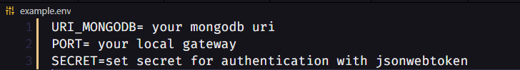

# auth backend 🔐

### test on your machine 💻
#
* first clone the auth-backend repository

* then, in your terminal type the command, __git clone + repository link__

* after doing this, access the folder and install the dependencies, with the command __yarn__ or __npm i__

* create an .env file in the project root, and add the following variables

> to create an account in mongo db

[mongodb](https://www.mongodb.com/)

> site to generate your secret

[base64encode](https://www.base64encode.org/)

> in the port variable put 80

✨✨✨✨✨✨✨✨✨✨✨✨✨✨✨✨✨✨✨✨✨

 __After completing all procedures,
in your terminal run yarn dev or npm run dev__

✨✨✨✨✨✨✨✨✨✨✨✨✨✨✨✨✨✨✨✨✨